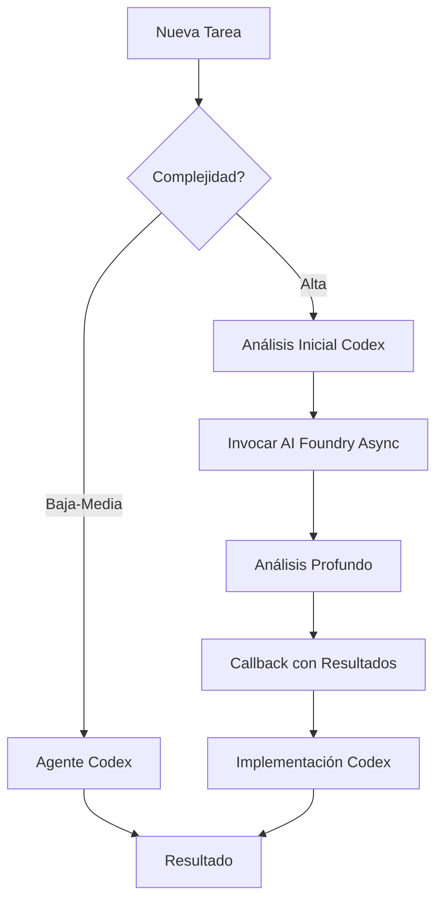

# 🤖 Integración Asíncrona: Codex + AI Foundry

## 📋 Arquitectura Híbrida de Agentes

El proyecto utiliza una arquitectura híbrida que combina:
- **Agentes Codex**: Para tareas rutinarias y desarrollo diario (80%)
- **AI Foundry (Azure OpenAI)**: Para análisis complejo y refactorización (20%)

## 🔄 Flujo de Trabajo Asíncrono



## 🚀 Ejemplos de Uso

### 1. Análisis Asíncrono de Componente Complejo

```javascript
// Comando para Mobile_App_Agent
@codex analyze-component --file HomeScreen.tsx --async

// Flujo interno:
// 1. Mobile_App_Agent hace scan inicial (síncrono)
// 2. Si complejidad > 15, invoca ReadTsxAgent (asíncrono)
// 3. ReadTsxAgent analiza en background usando GPT-4o
// 4. Callback notifica cuando está listo
// 5. Mobile_App_Agent presenta resultados
```

**Respuesta esperada:**
```json
{
  "taskId": "analysis-12345",
  "status": "processing",
  "estimatedTime": "2-3 minutes",
  "callbackUrl": "http://localhost:5000/webhook/callback/analysis-12345"
}
```

### 2. Optimización de Performance con Múltiples Agentes

```bash
# Trigger manual
@codex optimize-performance --module mobile-app --async --priority high
```

### 3. Generación de Tests en Batch

```javascript
// Para generar tests de múltiples componentes
@codex generate-tests --pattern "src/screens/**/*.tsx" --async --batch
```

## 🔧 Configuración de AI Foundry

### Deployment Activo: ReadTsxAgent
- **Modelo**: GPT-4o (2024-05-13)
- **Endpoint**: `https://boatrentalfoundry-dev.openai.azure.com/openai/deployments/ReadTsxAgent/chat/completions`
- **Rate Limits**: 10 RPM, 10,000 tokens/min
- **Capacidades**: 128K contexto, 4K output

### Agentes Especializados Disponibles
| Agente | Modelo | Use Case | Integration |
|--------|--------|----------|-------------|
| ReadTsxAgent | GPT-4o | Análisis TSX complejo | Mobile_App_Agent |
| RefactorAgent | GPT-4 | Refactorización | Mobile_App_Agent, Backend_Agent |
| PerformanceOptimizer | GPT-3.5 | Optimización | Mobile_App_Agent, Backend_Agent |
| TestingExpert | GPT-3.5 | Generación tests | Todos los agentes |
| ArchitectureAnalyzer | GPT-4 | Análisis arquitectura | Architect_BoatRental |

## 📊 Triggers Automáticos

Los agentes AI Foundry se invocan automáticamente cuando:

1. **Complejidad Ciclomática > 15**
   - Trigger: RefactorAgent
   - Notifica: Agente responsable del módulo

2. **Archivo > 500 líneas**
   - Trigger: ReadTsxAgent (para TSX) o RefactorAgent (otros)
   - Notifica: Mobile_App_Agent o Backend_Agent

3. **Cobertura de Tests < 70%**
   - Trigger: TestingExpert
   - Notifica: Todos los agentes relevantes

4. **Performance Regression Detectada**
   - Trigger: PerformanceOptimizer
   - Notifica: Mobile_App_Agent + Backend_Agent

## 🛠️ Comandos de Invocación

```bash
# Análisis de componente TSX
@codex invoke-foundry --agent ReadTsxAgent --file mobile-app/src/screens/home/HomeScreen.tsx

# Refactorización compleja
@codex invoke-foundry --agent RefactorAgent --complexity high --module mobile-app

# Análisis de arquitectura
@codex invoke-foundry --agent ArchitectureAnalyzer --scope full-project

# Verificar estado de tareas asíncronas
@codex status --async
```

## 📈 Monitoreo de Tareas Asíncronas

```bash
# Ver todas las tareas en progreso
@codex status --async

# Output:
┌─────────────┬──────────────────┬──────────┬─────────┬───────────┐
│ Task ID     │ Type             │ Agent    │ Status  │ Progress  │
├─────────────┼──────────────────┼──────────┼─────────┼───────────┤
│ tsx-98765   │ Component Analysis│ ReadTsx  │ Running │ 45%       │
│ perf-54321  │ Performance      │ PerfOpt  │ Queued  │ 0%        │
│ test-11111  │ Test Generation  │ TestExp  │ Running │ 78%       │
└─────────────┴──────────────────┴──────────┴─────────┴───────────┘
```

### Métricas en Tiempo Real

```javascript
// Webhook notification
POST /webhook/callback
{
  "taskId": "tsx-98765",
  "status": "completed",
  "agent": "ReadTsxAgent",
  "results": {
    "complexity": 18,
    "lines": 523,
    "dependencies": 12,
    "suggestions": [
      "Split into 3 smaller components",
      "Extract custom hooks",
      "Optimize re-renders"
    ]
  },
  "metrics": {
    "executionTime": 45000,
    "tokensUsed": 3500,
    "cost": 0.14
  }
}
```

## 🔄 Patrones de Integración

### Pattern 1: Fire and Forget
```javascript
// Para tareas no críticas
async function analyzeInBackground(file) {
  const taskId = await codex.analyzeAsync(file, {
    priority: 'low',
    callback: false
  });
  
  console.log(`Analysis started: ${taskId}`);
  // No esperar resultado
}
```

### Pattern 2: Async/Await con Polling
```javascript
// Para tareas críticas
async function refactorWithAI(component) {
  const taskId = await codex.refactorAsync(component, {
    priority: 'high',
    agent: 'RefactorAgent'
  });
  
  // Polling cada 5 segundos
  const result = await codex.waitForCompletion(taskId, {
    pollInterval: 5000,
    timeout: 300000
  });
  
  return result;
}
```

### Pattern 3: Event-Driven con Callbacks
```javascript
// Para flujos complejos
async function complexWorkflow(module) {
  const workflow = await codex.startWorkflow('performance_optimization', {
    module,
    callbacks: {
      onStepComplete: (step) => console.log(`Step ${step.id} completed`),
      onError: (error) => handleError(error),
      onComplete: (results) => applyOptimizations(results)
    }
  });
  
  return workflow.id;
}
```

## 🛡️ Manejo de Errores y Recuperación

### Retry Automático
```javascript
// Configuración en mcpconfig.json activa retry automático
{
  "retry_policy": {
    "max_attempts": 3,
    "backoff": "exponential",
    "on_errors": ["rate_limit", "timeout", "transient"]
  }
}
```

### Circuit Breaker
```javascript
// Protección contra fallos en cascada
if (await codex.isCircuitOpen('ai_foundry')) {
  console.log('AI Foundry temporarily unavailable, using Codex only');
  return await codex.executeSync(task);
}
```

## 📈 Optimización de Costos

### Estrategias de Ahorro

1. **Caché Inteligente**
   ```javascript
   // Resultados se cachean automáticamente
   const cached = await codex.checkCache('tsx-analysis', file.hash);
   if (cached) return cached;
   ```

2. **Batching de Requests**
   ```javascript
   // Agrupar análisis similares
   const files = await glob('src/**/*.tsx');
   const results = await codex.batchAnalyze(files, {
     batchSize: 20,
     useCheaperModel: true
   });
   ```

3. **Priorización Inteligente**
   ```javascript
   // Solo usar AI Foundry para alta complejidad
   if (complexity < 10) {
     return await codex.analyzeLocal(file);
   } else {
     return await codex.analyzeWithFoundry(file);
   }
   ```

## 🔍 Debugging Asíncrono

### Tracing Distribuido
```bash
# Ver trace completo de una tarea
@codex trace --task-id tsx-98765

# Output:
[2024-01-10 10:00:00] START Mobile_App_Agent.scan
[2024-01-10 10:00:02] COMPLETE complexity=18
[2024-01-10 10:00:03] INVOKE ReadTsxAgent (async)
[2024-01-10 10:00:03] QUEUED priority=high
[2024-01-10 10:00:05] PROCESSING ReadTsxAgent
[2024-01-10 10:00:45] COMPLETE analysis done
[2024-01-10 10:00:46] CALLBACK sent
[2024-01-10 10:00:47] INVOKE RefactorAgent (async)
...
```

### Logs Centralizados
```javascript
// Todos los logs asíncronos van a Azure Log Analytics
const logs = await codex.queryLogs({
  timeRange: 'last_hour',
  filter: 'agent:*foundry* AND status:error',
  limit: 100
});
```

## 🎯 Best Practices

1. **Siempre especificar timeouts**
2. **Usar callbacks para tareas largas**
3. **Implementar idempotencia**
4. **Monitorear rate limits**
5. **Cachear resultados costosos**
6. **Usar prioridades apropiadas**
7. **Implementar circuit breakers**
8. **Log de métricas de costo**

## 💰 Consideraciones de Costo

### Uso Eficiente
- **Codex First**: Siempre intentar con agentes Codex primero
- **Batch Operations**: Agrupar análisis complejos
- **Cache Results**: Los resultados de AI Foundry se cachean por 24h
- **Rate Limiting**: Respetar límites (6 req/min para GPT-3.5)

### Presupuesto Mensual Sugerido
- Desarrollo activo: 80% Codex, 20% AI Foundry
- Mantenimiento: 95% Codex, 5% AI Foundry
- Refactorización mayor: 60% Codex, 40% AI Foundry

## 📊 Métricas de Éxito

| Métrica | Target | Medición |
|---------|--------|----------|
| Tiempo de resolución | -30% | Con AI Foundry vs sin |
| Calidad del código | +25% | Score de complejidad |
| Cobertura de tests | >85% | Jest coverage |
| Bugs post-refactor | <5% | Issues reportados |

## 🔧 Configuración Recomendada

```yaml
# En .codegpt.yaml
ai_foundry:
  enabled: true
  auto_invoke: true
  complexity_threshold: 15
  file_size_threshold: 500
  test_coverage_threshold: 70
  
  agents:
    - ReadTsxAgent
    - RefactorAgent
    - ArchitectureAnalyzer
    - PerformanceOptimizer
    - TestingExpert
```

---

*Este documento debe actualizarse mensualmente basándose en métricas de uso y feedback del equipo.*